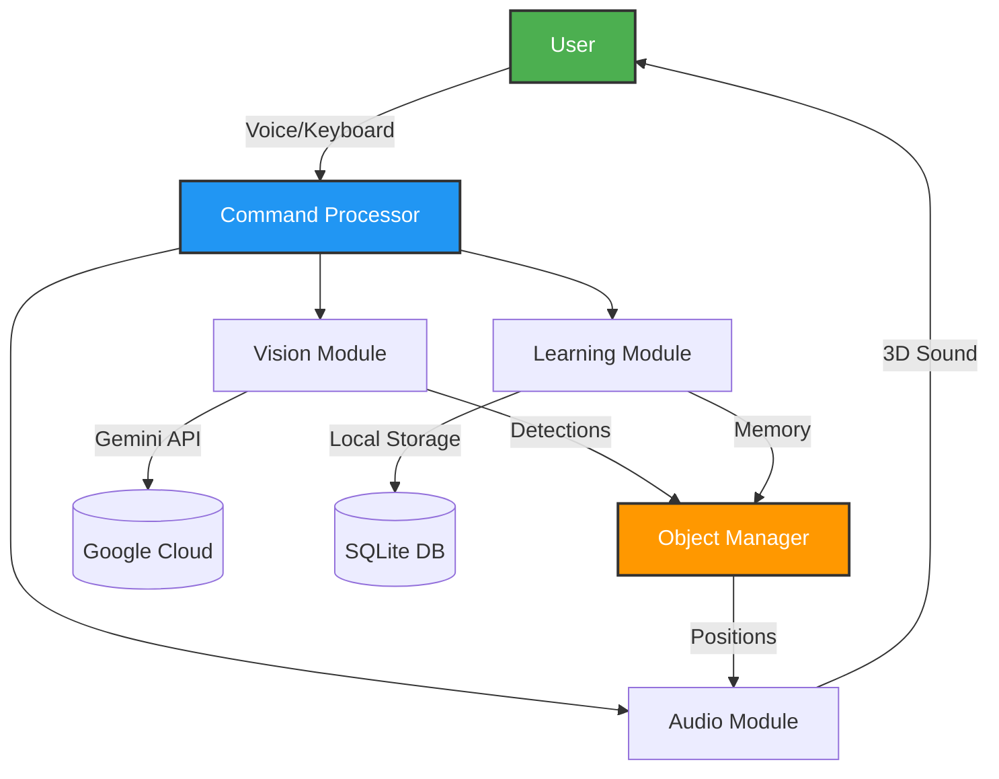

# An Experimental AI-Powered Assistive Navigation System

> **A research prototype for smart vision assistance that attempts to learn and remember an environment.**

**Notice:** This is a research prototype, not a finished product. It is an exploration of how AI vision, spatial memory, and 3D audio might be combined to assist with indoor navigation. Many features are incomplete, untested, or unstable. The primary goal of this project is to investigate a core hypothesis, not to provide a consumer-ready tool.

The central hypothesis is that an assistive tool can be more helpful if it remembers the location of objects and can guide a user back to them conversationally. This open-source prototype is my attempt to test that hypothesis.

---

## Quick Start

### 1. Install Dependencies
```bash
# On Ubuntu/Debian
sudo apt update && sudo apt install python3 python3-pip mpv

# Install Python libraries
pip install google-generativeai opencv-python opencv-contrib-python \
            sounddevice scipy groq edge-tts pydub pynput \
            --break-system-packages
```

### 2. Get API Keys
- **Google Gemini API**: [Get yours here](https://aistudio.google.com)
- **Groq API** (for speech): [Get yours here](https://console.groq.com)

### 3. Configure and Run
```bash
# Edit config.py with your API keys
nano config.py

# Run the system
python3 main_enhanced.py
```

### 4. Try It Out
- Press **F** to detect objects in front of the camera
- Press **C** to start voice recording, then ask: *"Where are my keys?"*
- Press **M** to switch between different operating modes

---

## Project Goals & Current State

This prototype attempts to:
- **See and identify objects** using a vision API. (Partially works; accuracy is dependent on the vision model and has not been formally benchmarked).
- **Remember and recall object locations** via a local database, accessible with voice commands. (The core mechanism works, but the natural language understanding can be brittle).
- **Guide the user to objects** using a rule-based 3D audio engine. (The engine works, but the audio cues are based on a heuristic and have not been user-tested for effectiveness).
- **Learn the environment** to reduce API calls. (This is a theoretical goal. The current implementation is a basic cache, and the cost-saving benefits are an unverified estimate).

---

## Known Issues & Limitations

- **Fragile Tracking:** The CSRT object tracker in OpenCV can lose its lock on an object if it moves too quickly, is partially obscured, or if the lighting changes. The system does not currently have a robust way to recover a lost track.
- **Noisy Voice Recognition:** The accuracy of voice commands can be poor in noisy environments.
- **Limited Context:** The system's "memory" is a simple database. It does not understand complex scenes or relationships between objects.
- **High Latency:** The reliance on cloud APIs for vision and speech-to-text means there can be significant latency between a user's command and the system's response.

---

## Origin Story: Why This Project Exists

I didn’t start this because of a big personal event. I started it because I was bored, curious, and slightly annoyed that existing systems felt limited. My initial thought was simple: *Can sound be used more intelligently for assistive technology?*

After exploring audio-based navigation content (like A-to-D audio guides), I became curious about the untapped potential of spatial audio. I researched existing assistive devices and smart glasses and noticed a common gap: most systems I found appeared to lack adaptive spatial audio and long-term environmental memory. They could see, but could they remember and learn?

This led me to a core set of questions:
- What if a system could remember where objects were left, answering questions like, *"Where did I leave my keys?"*
- How can audio guidance be made intuitive without causing listening fatigue?

The development process was one of trial and error. Early audio experiments with pink noise were too harsh, while the brain quickly adapted to and ignored brown noise. This led to the design of a custom adaptive beep system, where frequency and tone change based on the importance of the object being signaled. Many things broke along the way.

This system is the result of that exploration. It’s a research prototype and a work in progress, built on the idea that assistive technology should be smart, adaptive, and genuinely helpful.

---

## Technical Approach

### Key Technical Ideas Being Explored

#### Spatial Memory (The "Brain")

**The Problem:** Standard object detection is stateless. It forgets an object the moment it leaves the camera's view.

**Current Approach:** The system attempts to create a persistent "memory" by logging detected objects (label, position, timestamp) into a simple SQLite database. The goal is to allow users to ask conversational questions like, *"Where did I last see my keys?"* All data is stored locally. The "semantic context" feature is a rule-based heuristic that has not been rigorously tested.

#### 3D Spatial Audio (The "Guide")

**The Problem:** Simple stereo panning is unnatural and can be fatiguing. The brain may need more detailed audio cues to locate objects in 3D space.

**Current Approach:** The system uses a custom 3D audio engine to generate guidance cues. It's based on a set of heuristics (HRTF-inspired filtering, ITD simulation, distance-based attenuation) that are intended to make the audio feel more natural. The effectiveness of these cues has not been validated through user testing.

#### AI Vision + Tracking (The "Eyes")

**The Problem:** Relying solely on a vision API for real-time tracking would likely be too slow and expensive for this application.

**Current Approach:** A two-stage hybrid model. The system uses the Gemini API for initial object detection. Once an object is identified, a local CSRT tracker from OpenCV is used to follow it. This is intended to reduce API calls, but the **estimated** 40-70% reduction is a theoretical projection and has not been verified under real-world conditions.

#### Voice Control (The "Interface")

**The Problem:** An assistive device should ideally be controlled hands-free, using natural language.

**Current Approach:** The system's voice interface is a straightforward combination of off-the-shelf tools: Groq Whisper for speech-to-text and Microsoft Edge-TTS for voice output.

### System Architecture



### Technical Specifications

#### Hardware Requirements

| Component | Minimum | Recommended |
|-----------|---------|-------------|
| **Computer** | Any Linux system | Radxa Rock 5C (ARM SBC) |
| **Camera** | USB webcam (640x480) | USB webcam (720p+) |
| **Audio** | Speakers | Stereo headphones |
| **Microphone** | Built-in mic | External mic |

> [!TIP]
> The system includes code to auto-detect ARM processors and attempts to optimize performance where possible.

#### Software Stack
- **Vision AI:** Google Gemini (gemini-robotics-er-1.5-preview)
- **Object Tracking:** OpenCV CSRT
- **Speech Recognition:** Groq Whisper (whisper-large-v3-turbo)
- **Voice Synthesis:** Microsoft Edge-TTS
- **Database:** SQLite3
- **Audio:** sounddevice + scipy
- **Language:** Python 3.8+

#### Performance Metrics (**Estimates Only**)

**These numbers are unverified estimates and should be treated with skepticism.** They are based on informal testing on a Rock 5C ARM board and are not the result of rigorous benchmarking.

| Metric | Estimated Value | Notes |
|--------|-------|-------|
| **Frame Rate** | ~15-30 FPS | Highly variable, depends on scene complexity. |
| **Audio Latency** | <100ms | Not formally measured. |
| **Memory Query** | <10ms | For a small database. Untested at scale. |
| **API Cost** | ~$0.04/hour | **Theoretical projection** after learning phase. |
| **Storage** | ~50MB/1000 objects | **Estimate.** |

### How The Learning System Works

#### The Problem
Traditional assistive systems are often stateless, meaning they forget an object as soon as it leaves the camera's view.

#### Current Approach
This prototype explores the idea of **Persistent Spatial Memory** to build a simple "mental map" of an environment over time.

##### Step-by-Step Process

The process is based on a set of simple, rule-based steps:

1.  **Observation:** Every detected object is recorded with its label, position, timestamp, and a perceptual hash.
2.  **Storage:** This information is stored in a local SQLite database.
3.  **Recall:** When the user asks a question, the system queries the database and translates the most recent entry into a natural language response.
4.  **Optimization:** The "optimization" is a set of simple heuristics: prioritizing recent sightings (temporal decay), and merging duplicate entries. This is not a machine learning process.

### Project Structure
(The project structure diagram and file explanations would remain here as they are factual descriptions of the codebase.)

---

## Future Development Roadmap

This roadmap outlines planned features and long-term goals. It is aspirational and subject to change.

### Currently In-Progress
- [ ] ESP32 wireless connectivity
- [ ] Small OLED display for status
- [ ] Haptic feedback motors
- [ ] Battery management system

### Planned but Not Implemented
- [ ] **Real-time Translation** (OCR → Translate → Speech)
- [ ] **Depth Camera Support** (e.g., Intel RealSense)
- [ ] **Offline Mode** (using a local Whisper model and TinyML detection)

### Long-Term Research Questions
- Could federated learning be used to improve the system across multiple users without compromising privacy?
- How could the system move from simple object detection to true semantic scene understanding?

---

## Research Context

### High-Level Feature Comparison
This table is a high-level comparison of stated features based on publicly available information, not a formal performance benchmark.

| Feature | **This Prototype** | Envision AI | Seeing AI | OrCam MyEye |
|---------|----------------|-------------|-----------|-------------|
| **Spatial Memory** | ✅ (Experimental) | ❌ No | ❌ No | ❌ No |
| **Natural Language Queries** | ✅ (Experimental) | ❌ No | ❌ No | ❌ No |
| **3D Audio (HRTF-based)** | ✅ (Heuristic) | ❌ Stereo only | ❌ Stereo only | ❌ Stereo only |
| **Self-Learning** | ✅ (Heuristic) | ❌ No | ❌ No | ❌ No |
| **Open Source** | ✅ Yes | ❌ No | ❌ No | ❌ No |
| **Customizable** | ✅ Fully | ❌ No | ❌ No | ❌ No |

### Guiding Research Questions
- Can a system with conversational memory and spatial audio provide a more intuitive navigation experience than existing tools?
- What is the optimal balance between local and cloud-based processing for a low-cost assistive device?
- Does the use of persistent memory significantly reduce a user's cognitive load over time?

---

## Project Support

### Sponsors & Partners
This project is supported by the following industry leaders:

(Sponsor table remains here)

### Cost Breakdown (**Estimates Only**)

#### API Usage Costs
**These are theoretical projections and not guaranteed.**
- **Google Gemini API:** ~$0.02 - $0.12 / hour (estimate, depends on usage)
- **Groq Whisper (Speech):** Free tier is generous, likely free for typical use.
- **Edge-TTS (Voice):** Free.

#### Hardware Cost
- **DIY Setup:** ~$50
- **Recommended Setup:** ~$150
- **For context:** A commercial device like the OrCam MyEye costs ~$4,500. This is not a direct comparison of capability.

---

(The final sections: Contributing, Acknowledgments, License, Contact, Project Info, and Citation would remain largely the same, as they do not make claims about the project's capabilities.)
