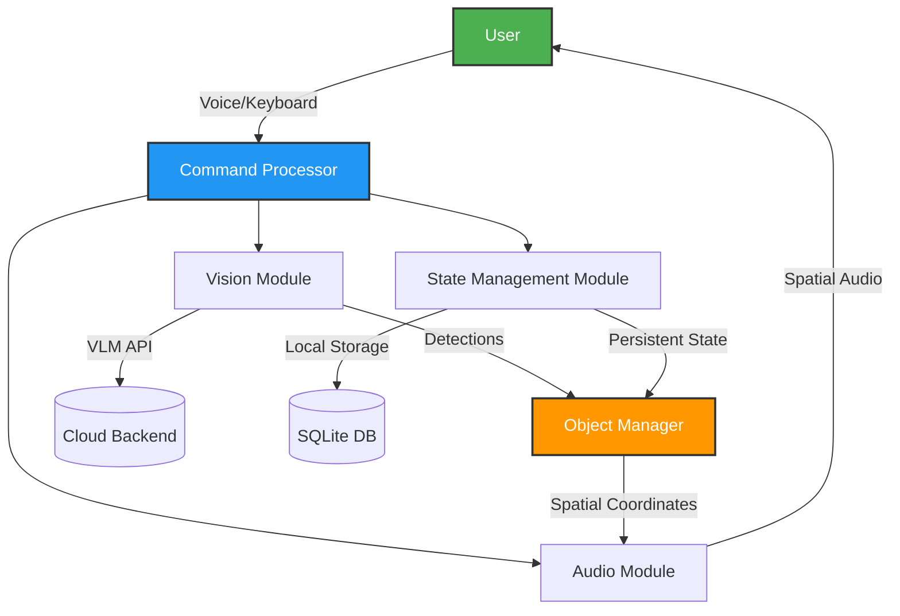

# Investigation into Persistent Spatial Memory for Assistive Vision

> **An experimental framework exploring the trade-offs between local heuristic state management and cloud-based Vision-Language Models (VLMs).**

**Notice:** This is a research prototype and technical exploration. It is not a consumer-ready tool. The project investigates the integration of VLM-based object detection, persistent local state, and spatial audio to assist with indoor environmental awareness.

The central hypothesis is that a **locally-persistent object history** can reduce redundant VLM queries in static indoor environments without a corresponding loss in navigation-relevant object retrieval latency. This prototype serves as an environment for testing this hypothesis.

---

## 🤝 Partners & Acknowledgments

This research is made possible through the support of industry partners providing the core infrastructure for this project and Nova:

- **[Radxa](https://radxa.com)**: Provided the **ROCK 5C** high-performance SBC, serving as the primary compute node for vision processing and testing for this project.
- **[DFRobot](https://www.dfrobot.com)**: Provided the **DFRobot Mega 2560** for testing and various actuators for other related research projects.
- **[Polymaker](https://polymaker.com)**: Provided advanced filaments for physical version testing of this technology and for the Nova humanoid framework.

---

## Quick Start

### 1. Install Dependencies
```bash
# System dependencies (Ubuntu/Debian)
sudo apt update && sudo apt install python3 python3-pip mpv

# Python libraries
pip install google-generativeai opencv-python opencv-contrib-python \
            sounddevice scipy groq edge-tts pydub pynput \
            --break-system-packages
```

### 2. Configure API Keys
Copy the template and add your API keys:
```bash
cp .env.example .env
nano .env  # Add your GOOGLE_API_KEY and GROQ_API_KEY
```

### 3. Execution
```bash
# The app loads GOOGLE_API_KEY and GROQ_API_KEY from .env automatically
python3 main_enhanced.py
```

For terminal-only or headless runs:
```bash
NOVA_HEADLESS=1 python3 main_enhanced.py
```

### 4. Default Runtime Behavior
- Core camera → detection/tracking → audio guidance stays enabled.
- Voice command support stays enabled when Groq is configured correctly.
- The following remain available but are now **optional / off by default** for stability:
  - Hardware serial integration
  - Persistent learning / recall
  - HRTF / room reverb path
  - Free-form chat persona
- If Groq or Gemini credentials are invalid, the app now degrades more cleanly instead of crashing.

### 5. Hardware Interaction
- **F**: Trigger VLM-based object detection (single frame)
- **C**: Initiate voice command recording
- **S**: Stop voice recording and process command
- **M**: Cycle through experimental operating modes
- **Q**: Quit

In terminal-only headless mode, use **Ctrl+C** to exit.

---

## Technical Objectives & Current State

This framework implements:
- **Heuristic-Guided Object Retrieval**: Uses VLM detections to populate a local state. (Functional; accuracy constrained by model selection and environmental lighting).
- **Persistent Object History**: Logs object metadata (label, normalized coordinates, timestamp) to a local SQLite store for natural language recall. (Stable core; natural language parsing is heuristic-based).
- **Spatial Audio Guidance**: A 3D audio engine for direction-finding. (Implemented using HRTF-inspired filters; effectiveness is subjective and lacks formal psychodynamic validation).
- **Redundant Query Suppression**: A caching mechanism designed to minimize API calls for known static objects. (Currently implements a simple temporal/spatial overlap check).

---

## Known Constraints & Limitations

- **Tracker Drift**: The local CSRT tracker is susceptible to occlusion and rapid viewpoint changes. No global re-localization is currently implemented.
- **NLP Brittleness**: Command parsing relies on keyword-matching and simple LLM prompting; it does not yet handle complex, multi-step spatial reasoning.
- **Latency Bottlenecks**: Round-trip time for cloud VLMs introduces a non-trivial delay (typically 1.5–3s) between environment change and system update.
- **Coordinate Drift**: Lacks SLAM/Odometry integration. Object "memory" is relative to the frame of detection, which degrades as the user moves.
- **Cloud Dependency**: The core vision and voice experience still depends on valid Gemini and Groq API credentials. Invalid keys now fail more safely, but they still disable major functionality.
- **Headless Usage**: GUI rendering is optional now, but fully interactive visual control still works best when a display is available.

---

## Technological Curiosity: The Origin of the Approach

This project originated from a technical curiosity regarding the "statelessness" of most consumer assistive vision tools. While commercial systems are excellent at identifying *what* is in front of the user *right now*, they often lack the temporal consistency required to answer questions about the past (e.g., *"Where did I put my phone two minutes ago?"*).

The development process prioritized exploring the limits of low-cost hardware (SBCs) paired with high-performance cloud APIs. Early experiments focused on audio ergonomics—moving away from harsh pink noise toward adaptive, frequency-modulated "pings" that encode distance and importance. This project is an ongoing attempt to bridge the gap between real-time tracking and long-term environmental memory.

---

---

## System Architecture

The framework is designed as a modular pipeline where data flows from environmental perception to spatial indexing and finally to audio-spatial rendering.

- **Sense Phase**: Captures video frames and multiplexes them between the VLM (for semantic identification) and the CSRT tracker (for frame-to-frame continuity).
- **Index Phase**: Interacts with the local SQLite store to reconcile new detections with historical data, applying temporal decay to stale entries.
- **Render Phase**: Transforms object coordinates into HRTF-modulated audio signals, producing the directional cues provided to the user.


```mermaid
graph TD
    A[User] -->|Voice/Keyboard| B[Command Processor]
    B --> C[Vision Module]
    B --> D[State Management Module]
    B --> E[Audio Module]
    
    C -->|Detections| F[Object Manager]
    D -->|Persistent State| F
    F -->|Spatial Coordinates| E
    E -->|Spatial Audio| A
    
    C -->|VLM API| G[(Cloud Backend)]
    D -->|Local Storage| H[(SQLite DB)]
    
    style A fill:#4CAF50,stroke:#333,stroke-width:2px,color:#fff
    style B fill:#2196F3,stroke:#333,stroke-width:2px,color:#fff
    style F fill:#FF9800,stroke:#333,stroke-width:2px,color:#fff
```

### Technical Specifications

#### Hardware Environment

| Component | Minimum | Recommended |
|-----------|---------|-------------|
| **Compute** | Linux-based x64 system | Radxa Rock 5C (ARM SBC) |
| **Optics** | USB Webcam (640x480) | 720p+ USB Camera |
| **Output** | Basic Speakers | Low-latency Stereo Headphones |
| **Input** | Built-in Microphone | Directional External Mic |

> [!TIP]
> The system includes ARM-specific optimizations for compute-limited environments.

#### Software Stack
- **Vision VLM**: Google Gemini (General Robotics variant)
- **Tracking**: OpenCV (CSRT Implementation)
- **STT**: Groq (Whisper-based)
- **TTS**: Microsoft Edge-TTS
- **Persistence**: SQLite3
- **Audio Processing**: `sounddevice` + `scipy`
- **Native Logic**: Python 3.8+

### Heuristic State Management: Under the Hood

#### The Problem
Stateless assistive systems lose all environmental context the moment an object leaves the camera's viewport, requiring repetitive and costly re-scanning.

#### The Implementation
This prototype explores **Persistent Object History** to maintain an internal representation of the environment.

1.  **Observation**: Detections are serialized with a label, bounding box, timestamp, and perceptual hash for deduplication.
2.  **Indexing**: Data is stored in a queryable SQLite database.
3.  **Recall**: Natural language queries are mapped to database lookups of the most recent known location.
4.  **Decay Heuristics**: Implements simple rules for merging duplicates and prioritizing recent sighting data over historical logs.

### Project Structure

The codebase is organized into discrete functional modules to facilitate experimentation:

- `main_enhanced.py`: Main execution loop and event handling.
- `vision_module.py`: Interface for VLM detection and classical tracking.
- `learning_module.py`: Logic for SQLite persistence and heuristic decay.
- `audio_module_multi.py`: 3D audio synthesis and HRTF filtering.
- `object_manager.py`: Coordinator for tracking multiple identities.
- `config.py`: Centralized configuration and API management.

---

## Future Development Roadmap

This roadmap outlines planned features and long-term research trajectories.

### Current Technical Tracks
- **Hardware Integration**: ESP32 wireless connectivity and haptic feedback research.
- **Multimodal Feedback**: Integrating small OLED status displays and battery telemetry.
- **Edge Processing**: Researching offline modes using local Whisper variants and TinyML.

### Research Questions
- How can coordinate frame consistency be maintained in the absence of a global SLAM system?
- What are the minimal semantic markers required for a VLM to reconstruct a scene graph from disjointed frames?

---

## Research Context & Trade-offs

This project occupies a niche between high-cost commercial assistive devices and generic mobile object-recognition apps.

- **Open Source Transparency**: Unlike closed-source commercial tools, all heuristics and data-handling practices are fully transparent and auditable.
- **Local Sovereignty**: Prioritizes local processing for spatial indexing and audio rendering, using the cloud only when semantic reasoning is required.
- **Experimental Interfaces**: Explores non-standard audio-spatial metaphors that are often too niche for broad commercial products.

---

## Resource Utilization

### API Dependency Notes
- **Google Gemini API**: Optimized for sparse, high-context queries.
- **Groq Whisper**: High-speed, low-latency speech-to-text.
- **Edge-TTS**: Cost-effective, natural-sounding voice synthesis.

### Hardware Reference
A functional prototype can be assembled for approximately **$50–$150**, significantly lower than the entry point for dedicated assistive hardware (e.g., OrCam). This cost reduction is achieved by shifting complex processing to cloud VLMs and using off-the-shelf Linux hardware.

---

## Citation & Acknowledgments

If using this framework for research, please cite it as an experimental prototype for spatial state management.

*(Standard contributing, license, and contact info remains below...)*
